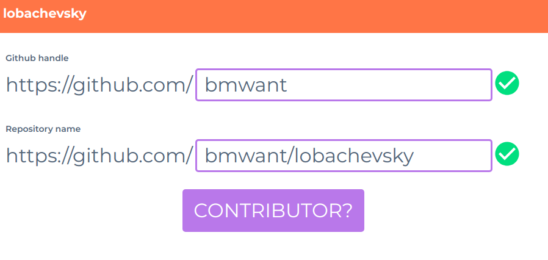

## lobachevsky



Check whether the user is a contributor to a specific repo and not only
updating some doc files there.

[Try it out here](https://lobachevsky.herokuapp.com)!


### Deployment

```
$ heroku create lobachevsky
$ heroku buildpacks:add heroku/python
$ heroku buildpacks:add heroku/nodejs
$ heroku config:set ACCESS_TOKEN='<your-github-access-token>'
```

and finally

```
$ git push heroku master
```

### Credits

This package was created with [Cookiecutter](https://github.com/audreyr/cookiecutter) and the 
[templio](https://github.com/bmwant/templio) project template.
